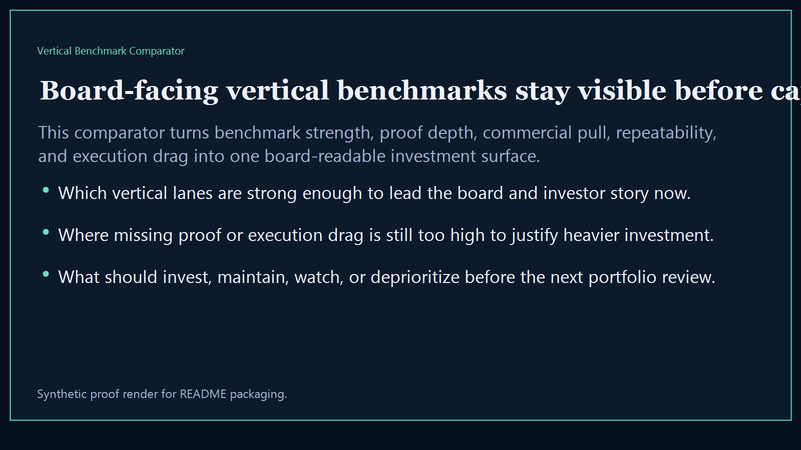
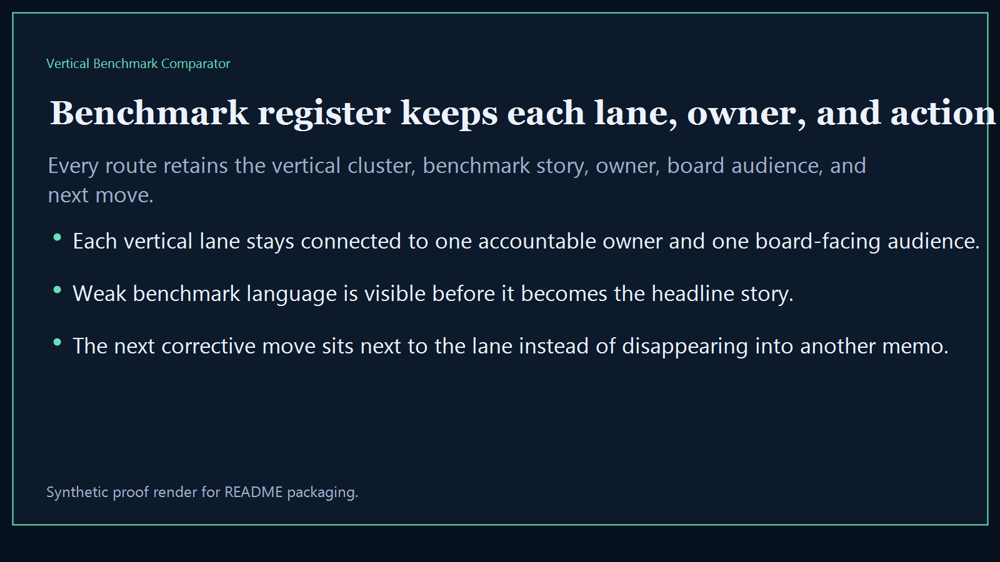
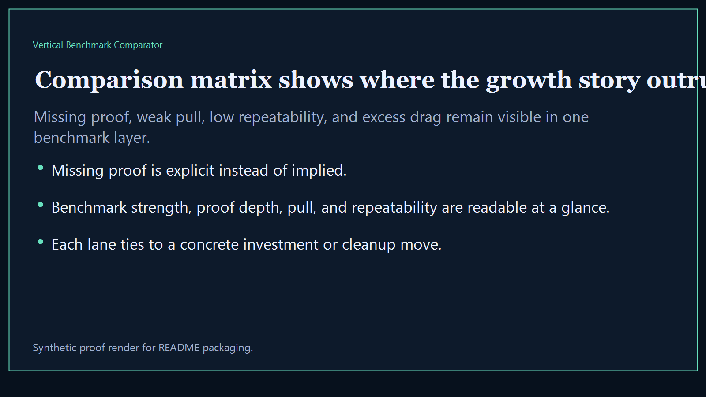
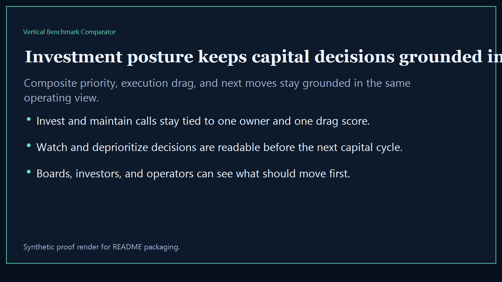

# Vertical Benchmark Comparator

Board-ready executive-intelligence surface for comparing vertical operating lanes, benchmark posture, and investment-readiness tradeoffs side by side.

- Live: `http://benchmark.kineticgain.com/`
- Repo: `mizcausevic-dev/vertical-benchmark-comparator`

## Why this matters

Leaders need one benchmark surface that shows which vertical lanes are strongest, which ones are underpowered, and where investment, savings, or evidence depth should move next before the next board or investor review.

## What it includes

- TypeScript executive-intelligence surface for comparing vertical posture, operating depth, and investment readiness
- synthetic lanes across multiple sectors, benchmark categories, and board-visible comparison dimensions
- reusable outputs for benchmark register, comparison matrix, investment posture, and board-ready portfolio narratives
- prerendered static site, JSON payloads, screenshots, and docs

## Routes

- `/`
- `/benchmark-register`
- `/comparison-matrix`
- `/investment-posture`
- `/verification`
- `/docs`

## Local run

```bash
cd vertical-benchmark-comparator
npm install
npm run verify
npm run prerender
npm run render:assets
```

## CLI

```bash
npx vertical-benchmark-comparator fixtures/vertical-benchmark-comparator.json --format summary
npx vertical-benchmark-comparator fixtures/vertical-benchmark-comparator-clean.json --format json
```

## Docs

- [Architecture](docs/architecture.md)
- [Origin](docs/ORIGIN.md)
- [Kinetic Gain Embedded](docs/KINETIC_GAIN_EMBEDDED.md)

## Screenshots





